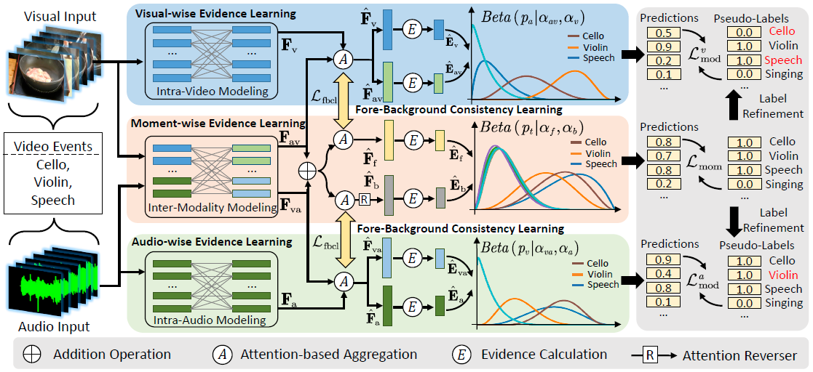
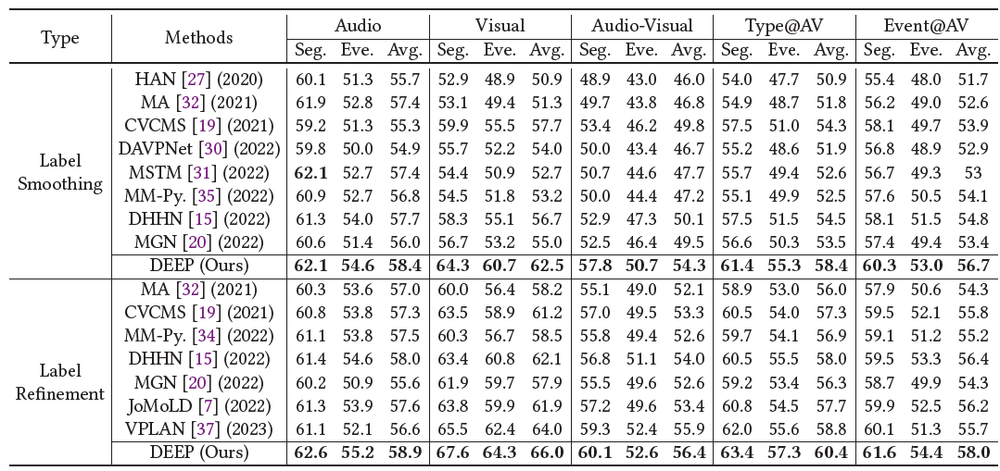
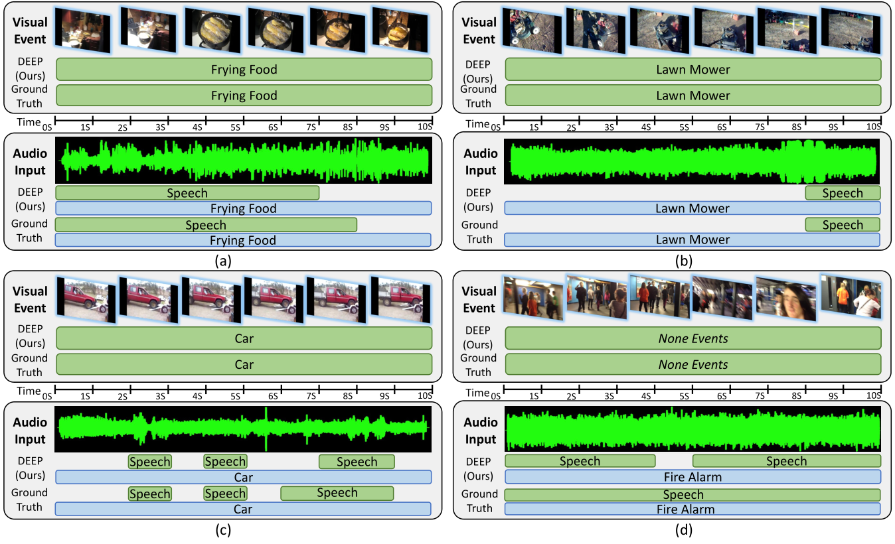

# Dual-Evidential Event Parsing in Audible Videos with Noisy Pseudo Labels

This is the anonymous PyTorch implementation for our paper "Dual-Evidential Event Parsing in Audible Videos with Noisy Pseudo Labels"
## Main Idea

The Audio-Visual Video Parsing (AVVP) task generally follows weakly-supervised learning settings, since only video-level labels are provided. Most existing works usually employ label smoothing or refinement mechanisms to generate pseudo-modality-wise labels for event parsing. In this work, we propose a novel AVVP framework termed Dual-Evidential Event Parsing (DEEP), which introduces evidential deep learning to overcome the limitations of noisy pseudo supervision. Specifically, our DEEP framework consists of three key components: 1) Modality-wise evidential learning that discriminates the modality-class dependency. 2) Moment-wise evidential learning that explores meaningful foregrounds. 3) Fore-background consistency learning for the collaboration of two evidential learning branches. Through perceiving meaningful video content and learning evidence for modality dependencies, our method suppresses the disturbance of noise in generated pseudo-labels. 

## Insight of Our Work

1. We propose a novel framework termed Dual-Evidential Event Parsing (DEEP) for AVVP, which utilizes evidential deep learning to overcome the noise in generated pseudo labels. Instead of using conventional additive probability, it tackles this task by calculating probabilities with Subjective Logic for each event category. 
2. We design a dual evidential learning architecture adapting to both modal and temporal dimensions. Such a design defends the noise disturbance in both modality discrimination and moment localization synchronously. 
3. To collaborate the modality-wise and moment-wise evidential learning branches, we furtherly propose an attention consistency learning mechanism, which keeps the model perceiving from meaningful temporal foregrounds in two branches consistently. 
4. The experimental results on the LLP dataset demonstrate that our method remarkably outperforms other state-of-the-art methods (4.2% without label refinement and 2.4% with label refinement for the average performance improvements on audio-visual events). 




# Experiments 


## Preparation

Please refer to https://github.com/YapengTian/AVVP-ECCV20 for downloading preprocessed audio and visual features. 
Put the downloaded r2plus1d_18, res152, vggish features into the data/feats folder.

## Training and Testing

For now, we provide the code of training model with label refinement and test. 
The complete implementation and detailed configurations will be released if paper is accepted. 

Training with Label Smoothing: 
```Bash
python main.py --mode train_with_label_smoothing --logger ./logger/DEEP_LS/
```

Training with Label Refinement: 
```Bash
python main.py --mode train_with_label_refinement --logger ./logger/DEEP_LR/ --noise_ratio_file noise_ratios.npz 
```

Test trained models:
```Bash
python main.py --mode test_models --logger ./logger/DEEP_LS/
```

## Model Performance




## Visualization Results




For more ablation studies and qualitative analysis, please kindly refer to our paper and supplementary materials.


This implementation partially referred to these works:

```ref
@inproceedings{cheng2022joint,
  title={Joint-Modal Label Denoising for Weakly-Supervised Audio-Visual Video Parsing},
  author={Cheng, Haoyue and Liu, Zhaoyang and Zhou, Hang and Qian, Chen and Wu, Wayne and Wang, Limin},
  booktitle={Computer Vision--ECCV 2022: 17th European Conference, Tel Aviv, Israel, October 23--27, 2022, Proceedings, Part XXXIV},
  pages={431--448},
  year={2022},
}

@inproceedings{chen2022dual,
  title={Dual-evidential learning for weakly-supervised temporal action localization},
  author={Chen, Mengyuan and Gao, Junyu and Yang, Shicai and Xu, Changsheng},
  booktitle={Computer Vision--ECCV 2022: 17th European Conference, Tel Aviv, Israel, October 23--27, 2022, Proceedings, Part IV},
  pages={192--208},
  year={2022},
  organization={Springer}
}

```
